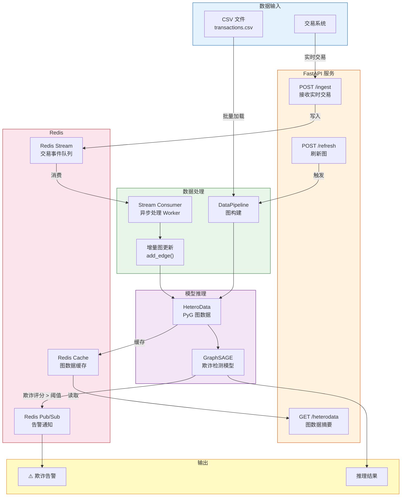

```mermaid
flowchart TB
    subgraph input["数据输入"]
        TX["交易系统"]
        CSV["CSV 文件<br/>transactions.csv"]
    end

    subgraph api["FastAPI 服务"]
        INGEST["POST /ingest<br/>接收实时交易"]
        HETERO["GET /heterodata<br/>图数据摘要"]
        REFRESH["POST /refresh<br/>刷新图"]
    end

    subgraph redis_layer["Redis"]
        STREAM["Redis Stream<br/>交易事件队列"]
        CACHE["Redis Cache<br/>图数据缓存"]
        PUBSUB["Redis Pub/Sub<br/>告警通知"]
    end

    subgraph processing["数据处理"]
        WORKER["Stream Consumer<br/>异步处理 Worker"]
        PIPELINE["DataPipeline<br/>图构建"]
        INCREMENTAL["增量图更新<br/>add_edge()"]
    end

    subgraph model["模型推理"]
        GRAPHSAGE["GraphSAGE<br/>欺诈检测模型"]
        HETERODATA["HeteroData<br/>PyG 图数据"]
    end

    subgraph output["输出"]
        ALERT["⚠️ 欺诈告警"]
        RESULT["推理结果"]
    end

    TX -->|实时交易| INGEST
    CSV -->|批量加载| PIPELINE

    INGEST -->|写入| STREAM
    STREAM -->|消费| WORKER
    WORKER --> INCREMENTAL
    INCREMENTAL --> HETERODATA

    PIPELINE --> HETERODATA
    HETERODATA --> GRAPHSAGE
    HETERODATA -->|缓存| CACHE
    CACHE -->|读取| HETERO

    GRAPHSAGE --> RESULT
    GRAPHSAGE -->|欺诈评分 > 阈值| PUBSUB
    PUBSUB --> ALERT

    REFRESH -->|触发| PIPELINE

    style input fill:#e3f2fd,stroke:#1565c0
    style api fill:#fff3e0,stroke:#e65100
    style redis_layer fill:#fce4ec,stroke:#c62828
    style processing fill:#e8f5e9,stroke:#2e7d32
    style model fill:#f3e5f5,stroke:#6a1b9a
    style output fill:#fff9c4,stroke:#f57f17
```
